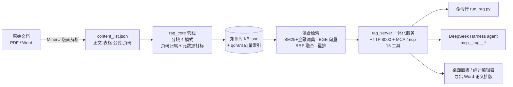

# RAG-Finance —— 金融论文检索增强问答系统

[](https://github.com/Miochiii/finance-paper-RAG/actions)

面向论文/文档知识库的本地 RAG 系统：**MinerU（PDF 解析）→ 四种分块模式 → 混合检索（BM25 + BGE 向量 + 重排）→ DeepSeek 问答**，提供命令行 / HTTP / MCP（DeepSeek Harness 工具）/ 桌面端四种使用方式，可被 agent 直接调用。

## 特性

- 📄 **多格式解析**：PDF 经 MinerU 版面解析（正文/表格/公式/图注，页码溯源），Word 直接提取；
- ✂️ **四种分块模式**：`fixed`（固定长度）/ `discourse`（章节感知）/ `hybrid`（表格感知）/ `hmm`（**HMM 无监督话题分割 + BIC 自适应选 K**，默认）；
- 🔍 **混合检索**：BM25（含金融领域词典）+ BGE 向量 + RRF 融合 + BGE-Reranker 精排；
- 🏷️ **元数据筛选检索**：按年份区间 / 作者 / 方法标签 / 任务标签过滤（如"只看 2022 年以后机器学习方法的信贷风控论文"）；
- 📑 **引用带页码**：回答引用形如 `[来源1] 论文.pdf，第12-13页`，可配合 DSH 插件直接翻到 PDF 对应页；
- 📥 **增量入库**：按文件哈希只处理新增文档，已有向量不动；
- 📊 **可观测性**：每次问答的延迟分解（改写/检索/生成）、token 消耗、成本估算、缓存命中率；
- 🧭 **方向辅助**：研究方向可行性分析、候选方向多维对比排序（基于本地文献证据）；
- 📝 **交互式综述工作台**：大纲协商 → 逐节生成（先检索后写作）→ 局部重写/手动编辑 → 导出；`survey_export` 附 **`editor_url` 浏览器编辑器**——手动修改文字或选中段落让 AI 重写（可选带知识库证据）；
- 🧪 **评测框架**：5 分块方法受控消融 + 检索/生成指标 + LLM-as-judge + 配对显著性检验（见「评测」节）；
- 🧩 **MCP 工具化**：15 个工具供 DeepSeek Harness 注册；
- 🖥️ **桌面端**：PyWebview 双窗口（DSH 对话 + 知识库面板）。

## 架构



数据流：MinerU 解析结果入库分块（含页码与元数据）→ 双索引（BM25 + 向量）→ 检索融合重排 → 同一服务进程对外提供 HTTP、MCP、桌面面板与综述编辑器四类入口，保证 qdrant 本地存储锁唯一持有。

## 目录结构

```
rag-finance/
├── rag_core/                # 核心管线（配置/解析/分块/检索/元数据/方向/综述/可观测）
├── rag_server.py            # 一体化服务（HTTP + MCP 单进程，15 个 MCP 工具）
├── run_rag.py               # 命令行入口
├── desktop_shell.py         # 桌面端（可选）
├── panel.html               # 知识库面板
├── editor.html              # 综述编辑器页面（/editor，浏览器新标签页）
├── evaluate.py              # 分块消融评测框架（5 方法 + 配对显著性检验）
├── build_docs_cache_v2.py   # MinerU 输出 → 评测用文档缓存
├── tests/                   # 单元测试（pytest，无需 GPU，78 项）
├── docs/
│   ├── DSH接入说明.md       # DeepSeek Harness 注册 MCP 工具步骤
│   └── EVAL.md              # 评测数据格式 / 指标定义 / 复现步骤 / 参考结果
├── data/
│   └── annotations/finance_annotations.csv.template  # 人工标注格式模板（数据本身不入库）
├── examples/                # 样例数据（3 分钟跑通全流程）
├── requirements.txt
├── .env.example
└── LICENSE                  # MIT
```

## 环境要求

- Windows 10/11 + NVIDIA GPU（CUDA 可用，8GB 显存以上体验最佳；纯 CPU 可跑但较慢）
- Python 3.10~3.12
- DeepSeek API Key（问答功能必需）

## 安装

```bash
python -m venv .venv
.venv\Scripts\activate
pip install -r requirements.txt -i https://pypi.tuna.tsinghua.edu.cn/simple   # 国内建议加镜像

# 配置
copy .env.example .env
# 编辑 .env：填入 deepseek_api=sk-你的密钥（其余默认指向项目内，无需改）
# .env 在启动时自动加载，无需手动设置系统环境变量
```

> 首次构建时会自动从 ModelScope 下载嵌入/重排模型（约 2GB，需联网）。

## 数据准备（PDF 解析）

Word 文档无需预处理，直接放入 `DOCS_DIR`（默认 `examples/input_docx`）即可。
PDF 需要先用 **MinerU** 解析（本仓库只消费它的解析产物，不依赖其代码）。

### MinerU 获取方式（二选一）

**方式一：官方安装**

```bash
pip install "mineru[core]"
# 详见 MinerU 官方文档：https://github.com/opendatalab/MinerU
```

**方式二：一键懒人包（Windows 推荐）**

B 站 UP 主 **「生活作弊码」** 2026-06-22 发布的 **MinerU 3 一键懒人包**：

- 下载链接：https://pan.baidu.com/s/1ykz7aFCGtwFonzeqWbpqOA?pwd=ftck
- 提取码：`ftck`

> 补充说明：这个直装包下载后，需要**在该直装包的 Python 环境中补充安装 `wrapt` 包**：
>
> ```powershell
> <直装包目录>\python\python.exe -m pip install wrapt
> ```

### 解析命令

```bash
# 官方 CLI
mineru -p <PDF目录或文件> -o <输出目录> -b vlm-engine
# 懒人包请使用其自带的批量脚本或
<直装包目录>\python\python.exe -m mineru.cli.client -p <PDF目录或文件> -o <输出目录> -b vlm-engine
```

解析完成后，把 `.env` 里的 `MINERU_OUT` 指向 `<输出目录>\batch`（或在启动时设置环境变量 `MINERU_OUT`）。

## 快速开始（用仓库自带样例，3 分钟跑通）

```bash
python run_rag.py health          # 环境自检
python run_rag.py build           # 构建知识库（样例 PDF 解析产物 + 样例 docx）
python run_rag.py stats           # 查看统计
python run_rag.py search "什么是混合检索"       # 纯检索
python run_rag.py ask "RAG 流水线有哪四个环节"   # 检索 + 生成（需 .env 配好密钥）
```

## 使用方式

| 方式 | 入口 |
|---|---|
| 命令行 | `python run_rag.py <build/ingest/stats/search/ask/open/health>` |
| HTTP 服务 | `python -m uvicorn rag_server:app --host 127.0.0.1 --port 8000`（接口见 rag_server.py 文档字符串） |
| MCP / DSH | 见 `docs/DSH接入说明.md`，注册后 agent 可用 `mcp__rag__*` 六个工具 |
| 桌面端 | `python desktop_shell.py`（需安装 pywebview；DSH 命令在 PATH 或 `.env` 设 `DSH_CMD`） |

### 增量入库

新文档（PDF 解析完 / 新 docx）放好后执行：

```bash
python run_rag.py ingest
```

只处理新增文档、只嵌入新块（几十秒级）；检测到删除/变更会自动全量重建。
agent 场景直接调用 `mcp__rag__ingest`。

### 引用页码 / 打开指定页

- 回答引用自动带页码（如 `[来源1] xxx.pdf，第12-13页`）；
- `python run_rag.py open 论文.pdf --page 12` 或 `mcp__rag__open_doc` 会用 SumatraPDF / Edge 打开 PDF 并翻到对应页；

## 运行统计（可观测性）

统计日志写入 `data/observability.jsonl`（路径可配 `RAG_OBS_LOG`），`stats` 工具/接口返回聚合结果：问答次数、延迟分解（改写/检索/生成、BM25/向量/重排）、token 与成本估算、HMM 块缓存与句嵌入缓存命中率。桌面面板的「📊 运行统计」区块直接可视化。

## 测试

```bash
pip install pytest
python -m pytest tests -q     # 全部为纯函数测试，不需要 GPU 与服务
```

## 评测（分块消融）

内置评测框架对 5 种分块方式做受控消融（唯一变量 = 分块方式，检索栈与生成配置全部固定），支持检索指标、生成指标、LLM-as-judge 打分与两两配对 t 检验 / Wilcoxon。

在自建金融论文语料（38 篇 MinerU 解析 + 40 条人工标注问答，数据非公开）上的参考结果（`--skip-gen` 检索指标均值，n=40）：

| 指标 | fixed | discourse | hybrid | hmm（默认） | hmm_fixed_k |
|---|---|---|---|---|---|
| recall@5 | 0.9250 | **0.9500** | 0.9250 | 0.9250 | **0.9500** |
| mrr | 0.8938 | **0.9375** | 0.9062 | 0.9062 | 0.9300 |
| ndcg@5 | 0.9015 | **0.9408** | 0.9108 | 0.9108 | 0.9347 |
| recall@5_c | 0.4164 | 0.4811 | **0.5168** | 0.4942 | 0.4621 |
| mrr_c | 0.3937 | **0.4946** | 0.4904 | 0.4842 | 0.4479 |
| ndcg@5_c | 0.3120 | 0.3860 | 0.3916 | **0.3930** | 0.3769 |

结论：① 文档级召回 ≥ 92.5%，检索栈对分块方式稳健，是系统质量的来源；② 块级证据召回（0.31–0.52）是主要短板，由"引用带页码 + 点击直开 PDF 对应页"兜底；③ 5 方法两两配对检验全部 p > 0.05（最接近的 fixed vs hybrid 块级 p≈0.057），分块方式不是质量瓶颈。

```bash
python build_docs_cache_v2.py --mineru-out <MinerU输出> --save data/docs_cache_v2.json
python evaluate.py --methods all --source finance --skip-gen --docs-cache data/docs_cache_v2.json
python evaluate.py --ttest-only --methods all --source finance
```

> 数据格式、指标定义、复现细节见 `docs/EVAL.md`；指标回归测试见 `tests/test_evaluate_metrics.py`。

## 常见问题

- **build 提示未找到文档**：检查 `MINERU_OUT` 与 `DOCS_DIR`（样例默认可用，真实数据需按上文配置）；
- **首次构建很慢**：嵌入/重排模型首次自动下载（约 2GB）；HMM 分块首次需逐句嵌入，同参数重跑命中缓存；
- **英文语料检索质量差**：`.env` 设 `BGE_EMBED_MODEL=bge-base-en-v1.5` 后重建（中英勿混跑）；
- **报 qdrant 锁冲突**：本地 qdrant 只允许一个进程访问，同一时刻只开一个服务；
- **端口被占用**：HTTP 服务用环境变量 `RAG_PORT` 或直接改 uvicorn 端口；MCP 的 DSH 补丁 url 同步修改。

## 许可

- 本仓库代码：MIT License；
- MinerU 为外部工具，请按其官方许可（AGPL-3.0）使用；懒人包相关权利归其发布者所有；
- `examples/` 样例数据为项目自撰，可自由使用。
