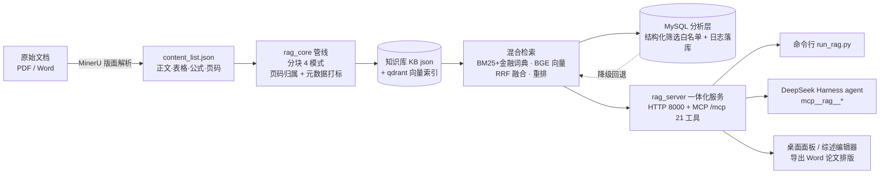

# RAG-Finance —— 金融论文检索增强问答系统

[](https://github.com/Miochiii/finance-paper-RAG/actions)

面向论文/文档知识库的本地 RAG 系统：**MinerU（PDF 解析）→ 四种分块模式 → 混合检索（BM25 + BGE 向量 + 重排）→ DeepSeek 问答**，提供命令行 / HTTP / MCP（DeepSeek Harness 工具）/ 桌面端四种使用方式，可被 agent 直接调用。

## 特性

- 📄 **多格式解析**：PDF 经 MinerU 版面解析（正文/表格/公式/图注，页码溯源），Word 直接提取；
- ✂️ **四种分块模式**：`fixed`（固定长度）/ `discourse`（章节感知）/ `hybrid`（表格感知）/ `hmm`（**HMM 无监督话题分割 + BIC 自适应选 K**，默认）；
- 🔍 **混合检索**：BM25（含金融领域词典）+ BGE 向量 + RRF 融合 + BGE-Reranker 精排；
- 🏷️ **元数据筛选检索**：按年份区间 / 作者 / 方法标签 / 任务标签过滤（如"只看 2022 年以后机器学习方法的信贷风控论文"）；
- 📑 **引用带页码**：回答引用形如 `[来源1] 论文.pdf，第12-13页`，可配合 DSH 插件直接翻到 PDF 对应页；
- 📥 **增量入库**：按文件哈希只处理新增文档，已有向量不动；
- 📊 **可观测性**：每次问答的延迟分解（改写/检索/生成）、token 消耗、成本估算、缓存命中率；
- 🧭 **方向辅助**：研究方向可行性分析、候选方向多维对比排序（基于本地文献证据）；
- 📝 **交互式综述工作台**：大纲协商 → 逐节生成（先检索后写作）→ 局部重写/手动编辑 → 导出；`survey_export` 附 **`editor_url` 浏览器编辑器**——手动修改文字或选中段落让 AI 重写（可选带知识库证据）；
- 🧪 **评测框架**：5 分块方法受控消融 + 检索/生成指标 + LLM-as-judge + 配对显著性检验（见「评测」节）；
- 🧩 **MCP 工具化**：21 个工具供 DeepSeek Harness 注册；
- 🗄️ **双引擎检索（MySQL 结构化层）**：年份/作者/方法/任务标签筛选先由 MySQL 出"文献白名单"再交给向量召回，MySQL 不可用或镜像过期自动降级为内存标签匹配；检索日志实时落库，延迟分位、HyDE/MMR 开关对比、评测指标对比、标签×年份分布都是 SQL 报表（见「结构化分析层」节）；
- 🗂️ **多语料管理**：多套语料各自建库（知识库/向量/元数据/词典/综述按语料隔离），一键切换激活；**关键词词典与标签词汇表随切换自动刷新**；面板支持新建语料（可后台建库）、切换与元数据筛选检索；
- 🖥️ **桌面端**：PyWebview 双窗口（DSH 对话 + 知识库面板）。

## 架构



数据流：MinerU 解析结果入库分块（含页码与元数据）→ 双索引（BM25 + 向量）→ 检索融合重排 → 同一服务进程对外提供 HTTP、MCP、桌面面板与综述编辑器四类入口，保证 qdrant 本地存储锁唯一持有。

## 目录结构

```
rag-finance/
├── rag_core/                # 核心管线（配置/解析/分块/检索/元数据/方向/综述/可观测/MySQL 分析层）
├── rag_server.py            # 一体化服务（HTTP + MCP 单进程，21 个 MCP 工具）
├── run_rag.py               # 命令行入口
├── sync_mysql.py            # MySQL 结构化分析层命令行（建表/同步/报表/筛选试跑）
├── desktop_shell.py         # 桌面端（可选）
├── panel.html               # 知识库面板
├── editor.html              # 综述编辑器页面（/editor，浏览器新标签页）
├── evaluate.py              # 分块消融评测框架（5 方法 + 配对显著性检验）
├── claim_audit.py           # 引用/证据审计：结论级核查"有没有证据支撑"
├── probe_validity.py        # E0：无标注代理指标有效性验证（相关性 + 区间 + 多重检验校正）
├── gen_annotations.py       # 评测集扩充：候选生成 + 逐字证据 + 事实核对 + 分级审核
├── build_docs_cache_v2.py   # MinerU 输出 → 评测用文档缓存
├── tests/                   # 单元测试（pytest，无需 GPU，151 项）
├── docs/
│   ├── DSH接入说明.md       # DeepSeek Harness 注册 MCP 工具步骤
│   └── EVAL.md              # 评测数据格式 / 指标定义 / 复现步骤 / 参考结果
├── data/
│   └── annotations/finance_annotations.csv.template  # 人工标注格式模板（数据本身不入库）
├── examples/                # 样例数据（3 分钟跑通全流程）
├── requirements.txt
├── .env.example
└── LICENSE                  # MIT
```

## 环境要求

- Windows 10/11 + NVIDIA GPU（CUDA 可用，8GB 显存以上体验最佳；纯 CPU 可跑但较慢）
- Python 3.10~3.12
- DeepSeek API Key（问答功能必需）

## 安装

```bash
python -m venv .venv
.venv\Scripts\activate
pip install -r requirements.txt -i https://pypi.tuna.tsinghua.edu.cn/simple   # 国内建议加镜像

# 配置
copy .env.example .env
# 编辑 .env：填入 deepseek_api=sk-你的密钥（其余默认指向项目内，无需改）
# .env 在启动时自动加载，无需手动设置系统环境变量
```

> 首次构建时会自动从 ModelScope 下载嵌入/重排模型（约 2GB，需联网）。

## 数据准备（PDF 解析）

Word 文档无需预处理，直接放入 `DOCS_DIR`（默认 `examples/input_docx`）即可。
PDF 需要先用 **MinerU** 解析（本仓库只消费它的解析产物，不依赖其代码）。

### MinerU 获取方式（二选一）

**方式一：官方安装**

```bash
pip install "mineru[core]"
# 详见 MinerU 官方文档：https://github.com/opendatalab/MinerU
```

**方式二：一键懒人包（Windows 推荐）**

B 站 UP 主 **「生活作弊码」** 2026-06-22 发布的 **MinerU 3 一键懒人包**：

- 下载链接：https://pan.baidu.com/s/1ykz7aFCGtwFonzeqWbpqOA?pwd=ftck
- 提取码：`ftck`

> 补充说明：这个直装包下载后，需要**在该直装包的 Python 环境中补充安装 `wrapt` 包**：
>
> ```powershell
> <直装包目录>\python\python.exe -m pip install wrapt
> ```

### 解析命令

```bash
# 官方 CLI
mineru -p <PDF目录或文件> -o <输出目录> -b vlm-engine
# 懒人包请使用其自带的批量脚本或
<直装包目录>\python\python.exe -m mineru.cli.client -p <PDF目录或文件> -o <输出目录> -b vlm-engine
```

解析完成后，把 `.env` 里的 `MINERU_OUT` 指向 `<输出目录>\batch`（或在启动时设置环境变量 `MINERU_OUT`）。

## 快速开始（用仓库自带样例，3 分钟跑通）

```bash
python run_rag.py health          # 环境自检
python run_rag.py build           # 构建知识库（样例 PDF 解析产物 + 样例 docx）
python run_rag.py stats           # 查看统计
python run_rag.py search "什么是混合检索"       # 纯检索
python run_rag.py ask "RAG 流水线有哪四个环节"   # 检索 + 生成（需 .env 配好密钥）
```

## 使用方式

| 方式 | 入口 |
|---|---|
| 命令行 | `python run_rag.py <build/ingest/stats/search/ask/open/health>` |
| HTTP 服务 | `python -m uvicorn rag_server:app --host 127.0.0.1 --port 8000`（接口见 rag_server.py 文档字符串） |
| MCP / DSH | 见 `docs/DSH接入说明.md`，注册后 agent 可用 `mcp__rag__*` 21 个工具 |
| 桌面端 | `python desktop_shell.py`（需安装 pywebview；DSH 命令在 PATH 或 `.env` 设 `DSH_CMD`） |

### 增量入库

新文档（PDF 解析完 / 新 docx）放好后执行：

```bash
python run_rag.py ingest
```

只处理新增文档、只嵌入新块（几十秒级）；检测到删除/变更会自动全量重建。
agent 场景直接调用 `mcp__rag__ingest`。

### 引用页码 / 打开指定页

- 回答引用自动带页码（如 `[来源1] xxx.pdf，第12-13页`）；
- `python run_rag.py open 论文.pdf --page 12` 或 `mcp__rag__open_doc` 会用 SumatraPDF / Edge 打开 PDF 并翻到对应页；

## 运行统计（可观测性）

统计日志写入 `data/observability.jsonl`（路径可配 `RAG_OBS_LOG`），`stats` 工具/接口返回聚合结果：问答次数、延迟分解（改写/检索/生成、BM25/向量/重排）、token 与成本估算、HMM 块缓存与句嵌入缓存命中率。桌面面板的「📊 运行统计」区块直接可视化。每次检索/问答还会**实时写入 MySQL 的 `fact_search_log`**（见下节），面板「🗄️ 数据库」区块可直接看延迟分位与开关对比。

## 结构化分析层（MySQL，双引擎检索）

知识库仍是 JSON（事实来源），MySQL 是**分析镜像 + 检索日志的账本**：结构化筛选走 SQL、日志与评测走 SQL 报表，两者互补而不是替换。

```
dim_corpus ─┬─ dim_document ─┬─ rel_doc_tag ─ dim_tag
            │                └─ fact_chunk            （5814 块级事实）
            └─ fact_search_log（实时 live + 补录 etl）  fact_eval（评测指标）
视图：v_tag_year（标签×年份分布）  v_hyde_mmr_latency（延迟分位 + HyDE/MMR 对比，窗口函数）
```

**① 双引擎检索**：筛选条件先由 MySQL 编译成 SQL 查出「文献白名单」，再翻译成块级掩码交给 BM25/向量召回（`rag_core/retriever.py::_filter_mask`）。若 MySQL 不可用、语料未同步、或镜像文献数与当前 KB 不一致（同步后又新增了文献），**自动降级**为内存标签匹配——两条路径语义严格一致（有交叉验证测试）。实际走哪条引擎记录在 `last_timing["filter_engine"]`，并落库供自检。

**② 日志双写与幂等**：检索/问答事件同时写 jsonl（崩溃也不丢的事实日志）与 MySQL（可即时查询）。每条记录带唯一 `rid`，ETL 补录前按 `rid` 反查，已实时写过的行跳过，因此「实时一份 + 补录一份」不会重复计数；MySQL 当时不可用漏写的行，正好由补录补齐——两条路径互为兜底。

**③ 报表即 SQL**：三张报表用视图与窗口函数实现（`PERCENT_RANK()` 算 p95、`GROUP BY` 做标签分布、`INSERT ... ON DUPLICATE KEY UPDATE` 做幂等 upsert）。

```bash
python sync_mysql.py --init     # 建库建表建视图（幂等，老库自动迁移新列）
python sync_mysql.py --sync     # 同步：维表/块表/评测/日志补录
python sync_mysql.py --stats    # 各表行数 + 语料年份分布 + 日志来源自检
python sync_mysql.py --report-kind latency   # 只跑某一类报表
python sync_mysql.py --filter "year_min=2020;methods=机器学习,深度学习;tasks=信贷风控"
                                # 复现检索时的双引擎判断（含镜像一致性守卫）
```

接口：`GET /mysql/stats`、`GET /mysql/report?kind=latency|eval|tags`、`POST /mysql/sync`；MCP 工具 `db_report`（agent 可直接问"检索延迟分布如何"）。连接参数用 `RAG_MYSQL_*` 环境变量或 `.env` 覆盖（`RAG_MYSQL_PASSWORD` 等），默认库名 `rag_analytics`。

## 可信度审计（引用 / 证据）

`claim_audit.py` 把生成答案拆成「结论」，逐条核查是否有证据支撑——度量的是 LLM-judge 忠实性**看不到**的东西：

```bash
python claim_audit.py --from-live        # 自洽口径：线上检索 → 现场重新生成 → 审计同一份证据
python claim_audit.py --limit 3          # 小样试跑（先确认提示词与解析正常）
python claim_audit.py --method discourse # 审计历史评测 CSV 的答案（上下文未存档，解读需谨慎）
```

口径与统计：证据池用生产配置（top_k=5、MMR 开）；每条结论判定 `supported / partial / unsupported / meta`
（`meta` = 对上下文的描述或拒答，不计入无支撑率，避免把"我不知道"当成错误）；同时检查引用编号是否
指向真实存在的证据块；比例按**题目级**聚合后用 t 区间给出置信区间（同题内结论相关，直接池化会高估显著性）。

在自建金融论文语料上的基线（40 题 / 209 条内容性结论，`hmm` 分块）：

| 指标 | 数值 |
|---|---|
| 无证据支撑的结论 | **1.0%**（2/209；Wilson 95% CI 0.3%~3.4%） |
| 部分支持（关键要素在证据里查不到） | 5.7%（12/209） |
| 描述 / 拒答类（不计入分母） | 11.5%（24/209） |
| gold 文献被召回 | 95.0%（38/40 题） |
| 引用编号越界（引用了不存在的来源号） | 0 处 |

**这个基线改变了优化方向**：生成层几乎没有编造（1%），再加一层引用校验收益有限；
真正的风险在**证据层**——没召回到正确文献时系统不会弃答，仍会给出自信、数字具体、连 LLM-judge
都打满分的结论（忠实 ≠ 证据正确）。因此后续把力气放在「证据充分性判断 → 弃答 / 定向补检索」，
而不是继续堆生成侧的校验。原始汇总见 `results/claim_audit_summary_*.md`（`results/` 不入库）。

## 测试

```bash
pip install pytest
python -m pytest tests -q     # 全部为纯函数测试，不需要 GPU 与服务
```

共 199 项：核心管线纯函数测试 + 双引擎/双写行为测试 + 审计/指标有效性/标注工具测试；MySQL 集成测试在检测到本机可用连接时才跑（CI 上自动跳过，用独立测试库 `rag_analytics_test`，跑完即删）。测试期间观测日志与分析库写入都会改指向（`tests/conftest.py`），不会污染真实数据。

## 评测集扩充（标注生成与审核）

评测结论的可信度取决于标注规模：n=40 时最小可检测效应 |ρ|≈0.31，n=120 时降到 0.18。
`gen_annotations.py` 把扩充流程做成可复现的四道关卡，**避免"用模型生成的答案当基准"**：

```bash
python gen_annotations.py --limit 2      # 试跑（看格式与质量）
python gen_annotations.py                # 全量：每篇论文出题（默认 3 题）
python gen_annotations.py --fact-check   # 重算分级 + 事实核对
python gen_annotations.py --bulk-approve 绿 --yes   # 绿区批量通过（写审计记录）
python gen_annotations.py --merge data/annotations/finance_annotations_v2_candidates.csv
```

四道关卡：**① 证据逐字**——模型只出题与答案，`gold_chunks` 由脚本从原文摘抄，并要求模型引文必须是原文子串，
不匹配就自动换成原文子句（`quote_fallback` 标记）；**② 事实核对**——答案里的数字与模型名必须出现在原文对应页，
否则标黄（能查出 OCR/LaTeX 形式的误报）；**③ LLM 质检**——答案是否被证据支持、是否唯一；
**④ 检索核验 + 分级**——gold 文献是否进 top-5、问题是否抄了标题词、是否与既有题重复（3-gram Jaccard）。
候选默认 `status=pending`，**evaluate.py 只读 done**，所以未经审核的候选不可能进入基准。

在自建金融论文语料上的一次实际扩充：38 篇 → 128 条候选，机器质检 128/128 通过、
事实核对 126/128、检索命中 117/128，成本约 ¥0.5；逐条人工审核（17 条黄/红项 + 12 条抽检）
后通过 126 条，评测集规模 **40 → 166 题**。

## 质量监控实验（E0：无标注代理指标的有效性）

在线监控不能依赖人工标注，只能用**无需标注即可计算的代理指标**（检索相似度、间隔、拒答率、引用形态等）。
`probe_validity.py` 检验这些代理是否真的反映系统质量——这是"无标注质量监控"能否成立的**前提实验**：

```bash
python probe_validity.py --fetch-missing   # 先补齐评测集的证据池（走线上检索，可中断续跑），再跑统计
python probe_validity.py                  # 已有证据池时直接跑（检索侧代理需本地 BGE）
python probe_validity.py --no-embed       # 跳过嵌入类指标，无需 GPU
```

口径：13 个代理 × 7 个真值（judge 正确性/忠实性、gold 召回、结论证据充分性、证据缺口率、
答案↔标准答案语义相似度、综合质量分）；Spearman ρ + 10000 次配对 bootstrap 区间 +
**批次内 Fisher 合并 ρ + 同族 Holm 校正**，并给出该样本量下的**最小可检测效应**
（n=166 时 |ρ| ≥ 0.15）。

**为什么判定必须分批做**：标注集有两批，构造方式不同——v1 由人工通读论文出题（需跨块综合），
v2 由模型依原文片段出题（答案落在给定块内）。两批的答案长度中位数 **343 vs 104 字**、
judge 满分占比 **62.5% vs 88.1%**，直接池化会把批次差异读成"长度↔质量"，
长度类、块数类指标会因此伪装成有效代理（复核记录见 `log/E0复核_批次混淆诊断_*.md`）。
因此报告输出三档判定：批次内稳健（✅）、批次伪信号/长度混淆（⚠️）、分布退化（⬜）。

自建语料上的结果（166 题）：

| 代理 → 真值 | 批次内合并 ρ | Holm p | 两批各自 ρ | 判定 |
|---|---|---|---|---|
| 拒答标志 → gold 文献被召回 | **−0.418** | 0.000 | −0.37 / −0.43 | ✅ 唯一跨批稳健（稀有事件） |
| 拒答标志 → 综合质量分 / judge 正确性 | −0.332 / −0.326 | 0.000 | 一致 | ✅ |
| 答案长度 / 结论数 / 引用密度 | −0.19 ~ −0.21 | 0.03~0.06 | 不一致 | ⚠️ 长度派生，与真值口径同源，不可独立使用 |
| 引用密度 → judge 忠实性 | +0.206 | 0.050 | −0.03 / +0.27 | ⚠️ 批次内不一致（伪信号） |
| 检索相似度 / 间隔 / 多样性 | \|ρ\| ≤ 0.15 | 不显著 | — | ⬜ v1（n=40）的 +0.48 **未复现**，属小样本假阳性 |

三条结论：**① 只有行为类代理（拒答）跨批次稳健**；**② 长度类指标是批次混淆的产物**，
不能当质量代理；**③ 检索分数类代理在 per-query 层面未获支持**，但这不等于它对漂移不敏感——
e-detector 依赖的是**窗口均值/分布**的移动，单条相关性弱 ≠ 窗口级检不出漂移，
这一点应由漂移注入实验（ARL/EDD）来判，而不是相关性。真值分辨率仍是瓶颈
（judge 满分占比 82%、证据充分性真值仅 40 题），下一批标注应**按难度分层**而非继续用块锚定生成。

## 评测（分块消融）

内置评测框架对 5 种分块方式做受控消融（唯一变量 = 分块方式，检索栈与生成配置全部固定），支持检索指标、生成指标、LLM-as-judge 打分与两两配对 t 检验 / Wilcoxon。

在自建金融论文语料（38 篇 MinerU 解析 + 40 条人工标注问答，数据非公开）上的参考结果（n=40）：

**检索指标**（`--skip-gen` 均值）：

| 指标 | fixed | discourse | hybrid | hmm（默认） | hmm_fixed_k |
|---|---|---|---|---|---|
| recall@5 | 0.9250 | **0.9500** | 0.9250 | 0.9250 | **0.9500** |
| mrr | 0.8938 | **0.9375** | 0.9062 | 0.9062 | 0.9300 |
| ndcg@5 | 0.9015 | **0.9408** | 0.9108 | 0.9108 | 0.9347 |
| recall@5_c | 0.4164 | 0.4811 | **0.5168** | 0.4942 | 0.4621 |
| mrr_c | 0.3937 | **0.4946** | 0.4904 | 0.4842 | 0.4479 |
| ndcg@5_c | 0.3120 | 0.3860 | 0.3916 | **0.3930** | 0.3769 |

**生成指标**（完整跑批均值，DeepSeek 生成 + LLM-as-judge 1~5 分）：

| 指标 | fixed | discourse | hybrid | hmm（默认） | hmm_fixed_k |
|---|---|---|---|---|---|
| judge 正确性 | 4.10 | 4.10 | **4.35** | 4.10 | 4.30 |
| judge 忠实性 | 4.70 | 4.83 | **4.88** | 4.65 | 4.73 |
| F1（字符级） | 0.159 | **0.166** | 0.158 | 0.154 | 0.164 |
| EM | 0.00 | 0.00 | 0.00 | 0.00 | 0.00 |

结论：① 文档级召回 ≥ 92.5%，检索栈对分块方式稳健，是系统质量的来源；② 块级证据召回（0.31–0.52）是主要短板，由"引用带页码 + 点击直开 PDF 对应页"兜底；③ **生成质量稳定**——正确性 4.1~4.4/5、忠实性 4.65~4.88/5，答案严格基于检索证据、不编造；④ 分块方式对检索与生成均无统计显著影响（90 组配对检验仅 discourse vs hmm 的 F1 一项 Wilcoxon p=0.039，多重比较下视为噪声；其余全部 p > 0.05）。EM/F1 低是因为标准答案是短句、生成答案是长段落，字符级匹配天然困难——生成质量以 judge 打分为准。

```bash
python build_docs_cache_v2.py --mineru-out <MinerU输出> --save data/docs_cache_v2.json
python evaluate.py --methods all --source finance --skip-gen --docs-cache data/docs_cache_v2.json   # 仅检索指标
python evaluate.py --methods all --source finance --docs-cache data/docs_cache_v2.json             # 完整（含生成与 judge，约 1.5h / 1~3 元 API）
python evaluate.py --ttest-only --methods all --source finance
```

> 数据格式、指标定义、复现细节见 `docs/EVAL.md`；指标回归测试见 `tests/test_evaluate_metrics.py`。

## 常见问题

- **build 提示未找到文档**：检查 `MINERU_OUT` 与 `DOCS_DIR`（样例默认可用，真实数据需按上文配置）；
- **首次构建很慢**：嵌入/重排模型首次自动下载（约 2GB）；HMM 分块首次需逐句嵌入，同参数重跑命中缓存；
- **英文语料检索质量差**：`.env` 设 `BGE_EMBED_MODEL=bge-base-en-v1.5` 后重建（中英勿混跑）；
- **报 qdrant 锁冲突**：本地 qdrant 只允许一个进程访问，同一时刻只开一个服务；
- **端口被占用**：HTTP 服务用环境变量 `RAG_PORT` 或直接改 uvicorn 端口；MCP 的 DSH 补丁 url 同步修改。

## 许可

- 本仓库代码：MIT License；
- MinerU 为外部工具，请按其官方许可（AGPL-3.0）使用；懒人包相关权利归其发布者所有；
- `examples/` 样例数据为项目自撰，可自由使用。
