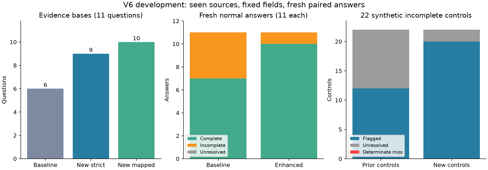

# 明确字段检索 V6：开发配对验证

## 结论

同一批11道已见来源题，新配置的核对依据有效数从 6/11 变为 10/11（不做符号映射时 9/11）。
两种配置各生成11条新回答：完整数 7→10；不完整数 4→1；质量未定数 0→0。逐题改善 4，退化 1，质量未定配对 0。
22条合成不完整对照检出 20，确定漏检 0，未定 2；完整对照误报 0/11。预设自动评分对照门槛：**passed**。未定保留在全部分母中。

## 本轮改动与设计

- 缩短公开题干的查询，去掉论文标题和作答模板；按公开字段构造查询，保留对象、时期和表号。
- 增加表格完整窗口，显式表号匹配可以进入候选；重排后去除高度重叠段落。
- 两种配置均最多3段、原文合计6000字符；检索范围仍限题干公开可见的论文。
- 对原文提取字段增加可追溯的表示映射：\varepsilon→ε、\epsilon→ϵ、转义下划线、数学分隔符和空白。保留原始摘录、原始范围；不改变数值、单位或运算符。
- 新回答前冻结原文、代码、检索结果、核对依据、全部55案例和单字段修改对照；无按回答选择样本。
- 拒答规则在新回答前冻结；同时报告原规则与字段规则，旧结果不重写。

## 检索后原文可用性

仅测冻结规范摘录是否逐字出现，用于开发诊断；其数值不能代替语义支持或回答质量。标准答案和原文摘录均不进入检索接口。

|题号|必答字段|旧摘录数|新摘录数|旧依据有效|新严格有效|新映射有效|
|---|---:|---:|---:|---:|---:|---:|
|O0001|2|2|2|0|0|1|
|O0002|2|2|2|1|1|1|
|O0003|3|3|3|1|1|1|
|O0004|3|0|3|0|1|1|
|O0005|2|2|2|1|1|1|
|O0006|3|3|3|1|1|1|
|O0007|2|0|2|0|1|1|
|O0008|3|3|0|1|1|1|
|O0009|2|0|2|0|1|1|
|O0010|2|0|2|0|1|1|
|O0011|3|3|0|1|0|0|

## 全部信号结果

|条件|N|完整|不完整|质量U|代理U|坏回答检出|确定漏检|坏回答U|完整误报|字段拒答|
|---|---:|---:|---:|---:|---:|---:|---:|---:|---:|---:|
|controls|33|11|22|0|3|20|0|2|0|0|
|control_complete|11|11|0|0|1|0|0|0|0|0|
|control_omitted|11|0|11|0|1|10|0|1|0|0|
|control_corrupted|11|0|11|0|1|10|0|1|0|0|
|live_baseline|11|7|4|0|5|0|0|4|0|4|
|live_enhanced|11|10|1|0|1|0|0|1|0|0|

## 新回答逐题配对

|题号|旧质量|新质量|旧代理|新代理|旧字段拒答|新字段拒答|
|---|---:|---:|---|---|---:|---:|
|O0001|2|2|U|complete|0|0|
|O0002|2|2|complete|complete|0|0|
|O0003|2|2|complete|complete|0|0|
|O0004|0|2|U|complete|1|0|
|O0005|2|2|complete|complete|0|0|
|O0006|2|2|complete|complete|0|0|
|O0007|0|2|U|complete|1|0|
|O0008|2|2|complete|complete|0|0|
|O0009|0|2|U|complete|1|0|
|O0010|0|2|U|complete|1|0|
|O0011|2|1|complete|U|0|0|

22条新回答中原拒答规则识别 0 条，预先冻结的字段规则识别 4 条。该比较只针对本轮实际回答；不能据此给出总体拒答识别准确率。

## 剩余具体问题

O0011的新检索第一段末尾停在“从2011年开始至20”，原文紧接着为“18年的交易数据”。字符窗口切断了结束年份。新回答给出了18个行业和1696家公司，却只能报告不完整的样本期间，质量为1；代理U、字段拒答0，仍未检出这条部分回答。
这条失败不能因其他10条正常回答完整而排除。下一版应在固定原文预算内保留句子/日期完整边界，再用新回答验证；本轮冻结窗口和结果保持原样。

## 审计与解释边界

审计 passed；13项相关单元测试通过。191 个新API响应，274164 tokens；实际返回模型 {"deepseek-flash": 191}；生成结束原因 {'stop': 22}。
本轮沿用已见论文和题目，是开发比较。表格分块、查询、去重和符号映射同时改动，不能单独归因。两次自动裁判仍来自同一家模型，完整性不等于独立人工正确性。
合成遗漏/改错是在答案文本上修改，用于验证自动评分；本轮新生成的只有正常答案，尚未完成真实证据故障配对，也没有证明变点检测优于基线。
下一步按逐题退化情况改善检索的稳定性，再冻结配置到独立题目验证；随后再运行真实证据干预和长序列变点实验。

