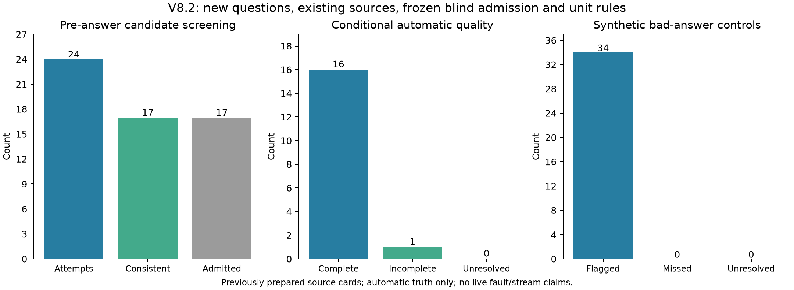

# 新题验证V8.2：来源盲提取准入与严格单位规则

## 结论

预设自动验证门槛：**passed**。尝试24道候选，程序有效18，来源盲提取与参考一致17，最终实验准入17题/11篇来源。
正常新回答：自动参考评分完整16/17，不完整1，质量未定0。检索核对依据有效17/17。
合成遗漏/改错对照：检出34/34，确定漏检0，未定0。完整对照误报0/17，完整对照代理未定0。
全部未定保留在分母。没有按待测回答结果换题、改参考、重做检索或调整评分规则。候选继续保持pending，未进入正式标注集。

## 本轮新增且预先冻结的规则

- 先前V8的重复百分号预检失败没有拦住生成，属于流程缺陷；该轮全部记录保留且不作确认性结论。V8.1准备阶段24次尝试仅5题通过，未生成任何待测回答。本轮在同一批准备卡片上统一重建24道候选；旧题移出生成载荷，仅在程序内去重。规则与工具先于新候选锁定。
- 强制预检校验参考及临时核对事实的数值、单位与展示投影；必须先形成passed锁，生成函数才能执行。来源有逐字支持的重复百分号单位只删除一次，不改变数值量级。
- 候选来源来自原始MinerU table/text块，拒绝chart重建和明确近似数字；每段不超过900字符，每篇最多4段和2道候选。
- 卡片选择时整理历史结构化证据/引文的原文区间；所选块当时未与登记区间重叠。本轮卡片已用于V8.1出题准备，因此不能称为完全新片段。不能保证项目其他未登记处理或供应商从未见过这些片段。
- 来源卡片提取请求只有问题、公共字段与原文，没有拟定参考值、单位或参考引文；两轮来源检查后才与参考比较，最后再做两轮带参考的来源审查。
- 不支持或不一致的候选不通过准入，不用拟定参考补齐盲提取。严格单位拆分只接受逐字来源中的单个数字与已知单位；不换算、不舍入。
- 百分号仅输出一次，5%与无单位0.05不混同；公开字段、BGE检索和句子边界规则、生成配置、回答比较规则与拒答规则沿用上一版。

## 全部指标

|条件|N|完整|不完整|质量U|代理U|错误检出|错误U|完整误报|
|---|---:|---:|---:|---:|---:|---:|---:|---:|
|controls|51|17|34|0|0|34|0|0|
|control_complete|17|17|0|0|0|0|0|0|
|control_omitted|17|0|17|0|0|17|0|0|
|control_corrupted|17|0|17|0|0|17|0|0|
|live_normal|17|16|1|0|0|1|0|0|

## 按论文分组

|来源|新正常回答N|完整|不完整|质量U|代理U|
|---|---:|---:|---:|---:|---:|
|信息熵在机器学习算法中的运用_张璐瑶.pdf|2|2|0|0|0|
|基于文本挖掘和机器学习算法的股票投资研究_陆航航.pdf|1|1|0|0|0|
|基于机器学习和新闻文本的原油期货资产配置研究_钟浩.pdf|2|2|0|0|0|
|基于机器学习的实证资产定价研究_马甜.pdf|2|2|0|0|0|
|基于机器学习算法的P2P网络借贷信用评级产品设计_路杨宁.pdf|2|1|1|0|0|
|基于机器学习算法的互联网金融风控模型研究_范晶晶.pdf|1|1|0|0|0|
|基于机器学习算法的商品期货配对交易策略研究_黎炫朝.pdf|1|1|0|0|0|
|基于机器学习算法的选股与择时量化投资策略研究_孙博文.pdf|1|1|0|0|0|
|基于机器学习算法的黑色系期货价格预测_郭梓晗.pdf|2|2|0|0|0|
|气候金融背景下的气温衍生品定价研究——基于机器学习算法_杨刚.pdf|2|2|0|0|0|
|面向不平衡数据集的机器学习算法对信贷风险的研究_游云贝.pdf|1|1|0|0|0|

## 解释边界

这是新题、已有论文来源的前瞻验证。来源和题目先冻结再生成待测回答，但论文不是整个项目未见的新文献。每篇最多2题，同文献题目与合成对照不视为独立样本。
来源一致性、提取和答案评分仍使用同一家服务。多轮一致是自动检查，不是独立人工真值；MinerU文本未逐页独立核对。自动完整数不能写成独立确认的真实正确率。
本轮正常回答是真实新生成，故障对照是在答案上改一个字段；没有生成真实证据故障回答，没有长序列变点试验。不能把错误对照检出率当作变点检测检出率。
上一轮开发题的单位修复回放不混入本轮成绩，本轮也不改写上一轮的28/32及4个未定。
请求模型deepseek-chat；实际响应模型{'deepseek-flash': 371}。新响应371，tokens 478131；生成结束{'stop': 17}。
完整性审计passed，覆盖来源位置、公开载荷、准入、时间顺序、原始请求和评分重放。审计不证明参考语义绝对正确。

## 下一步

若门槛通过，固定本轮正常检索建立核对依据，然后仅干预生成端证据，生成真实正常/故障配对。先核查故障是否确实降低质量，再冻结长序列与简单拒答、滑窗、CUSUM和e-detector比较。
若未通过，先按全部未定和失败原因另立开发版本，不改写本轮题库、门槛和成绩。无需追加人工复核，结论保留自动评价的限定。

## 表格方向复查及独立开发对照

主表P0002要求续表5-6第3个样本，却将顺序写成“行顺序”。原始MinerU表的Score与评级是两行，样本实际上按列排列。按照第三数据列解释，原回答不符合这两个字段，但题干方向表述也影响错误归因；因此不能把该例直接作为无歧义的真实错误金标准。原始17题成绩与34条错误控制结果保留。

另立单案例开发协议：程序解析源表第3个数据列确认目标单元格，保持相同检索上下文，为原题与明确“从左到右第3个数据列、不含行标题列”的题各新生成一次回答。原题在第三列解释下质量0/代理incomplete；明确版质量2/代理complete。两题均未拒答。此为1个已见案例的开发比较，不能与主表16/17合并为新的17/17，也不能据此宣称普遍改善。

方向澄清、两版盲核对依据和目标单元格均在这2条新回答前冻结；程序表格解析相关测试2项通过，开发对照输入/响应哈希审计通过。主实验相关测试26项通过。后续真实证据配对将使用已准备的明确列方向题库，重新冻结与生成，不改写当前主结果。
