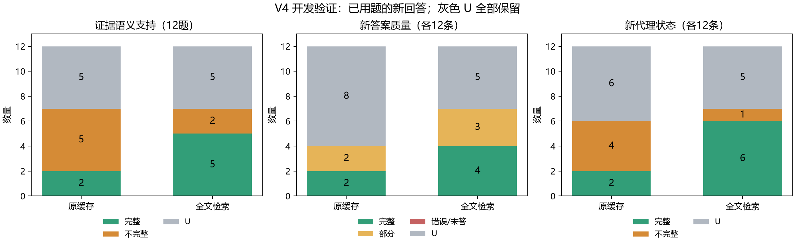

# MinerU 全文检索与覆盖代理 V4：开发验证结果

## 本轮范围

沿用上一轮12道已用题，固定原缓存和实际可见论文范围内的全文检索证据各生成12条新回答，另加1条固定缺参数对照。全部问题、依据、检索和引用校验规则在生成前冻结，未按回答结果选题。全文检索沿用2000字符窗口、1500步长、字符TF-IDF前20候选、BGE 4096 token重排、前3段的配置。标准事实不参与检索。

本轮属于已用题上的开发验证，不能作为独立泛化结果，也不能推导在线变点检测的误报保证。新方法未替换已冻结的V3结果或修改线上RAG服务。

## 引用校验与判分修改

V4先核对真实原文子串，再识别配对的Markdown展示标记，并保存回答原始位置。裸AUC/F1等短实体仅在边界正确且唯一时可定位，随后扩展真实上下文；虚构句子、改变数值和数学运算符不会被近似匹配。每轮最多补做一次引用复制，原语义状态和遗漏列表不允许改变。两轮未达成一致仍为U。

离线质量总分由验证后的逐点状态导出，消除了‘总分完整但逐点部分回答’的内部矛盾：全部covered为2，有部分覆盖为1；有实质矛盾或全部missing为0；未定/分歧/截断为U。依据由问题和原始MinerU片段重新提取、两轮检查，生成时不可见。它仍是自动代理依据，尚不能视为人类金标准。

## 结果

|条件|新答案数|完整答案|不完整答案|质量U|代理U|完整答案误报|不完整检出|不完整漏检|不完整未定|拒答|
|---|---:|---:|---:|---:|---:|---:|---:|---:|---:|---:|
|原缓存|12|2|2|8|6|0|1|0|1|0|
|全文检索|12|4|3|5|5|0|1|1|1|0|
|缺参数对照|1|0|1|0|0|0|1|0|0|0|
|全部|25|6|6|13|11|0|3|1|2|0|

两轮依据审查一致：7/12题；临时检索代理依据有效：7/12题。依据一致的题中，语义完整证据为原缓存 2/7，全文检索 5/7。

可确定的配对答案中：质量提升 1 对，降低 0 对；另有 8 对至少一侧质量U。

|题号|新依据有效|原缓存证据|全文检索证据|原缓存质量|全文检索质量|临时代理依据有效|
|---|---:|---|---|---|---|---:|
|fin_007|1|complete|complete|2|2|0|
|fin_008|1|incomplete|incomplete|1|1|0|
|fin_011|0|U|U|U|U|0|
|fin_013|1|complete|complete|2|2|1|
|fin_014|0|U|U|U|U|1|
|fin_017|0|U|U|U|U|0|
|fin_019|1|incomplete|incomplete|U|1|1|
|fin_022|1|incomplete|complete|1|2|1|
|fin_023|0|U|U|U|U|1|
|fin_024|0|U|U|U|U|1|
|fin_036|1|incomplete|complete|U|2|0|
|fin_039|1|incomplete|complete|U|1|1|

## 两个范围争议的处理

这些审查只查看问题和原文，未查看本轮新答案。原来的规范依据保持不变，以下是新版本的开发依据：

### fin_007

什么是基于人工智能算法生成观点的Black-Litterman 投资组合模型？

新依据有效：True。

- 基于人工智能算法生成观点的Black-Litterman投资组合模型是在Black-Litterman-Bayes框架下，用机器学习算法生成的预测观点替换经典Black-Litterman模型中需要咨询专家得到的主观观点。
- 该模型使用逻辑回归、支持向量机、随机森林、极限提升树、多层感知机等多种机器学习算法生成投资观点。

### fin_022

风控模型的性能度量有哪些指标？

新依据有效：True。

- 风控模型的性能度量指标包括错误率和准确度。
- 风控模型的性能度量指标包括精准率和召回率。
- 风控模型的性能度量指标包括F1-Score。
- 风控模型的性能度量指标包括ROC和AUC。

## 固定门槛与结论

本轮预设开发门槛：**not_passed**。

- scope_valid: False
- retrieved_semantic_complete: False
- proxy_available: False
- no_complete_false_flags: True
- enough_incomplete: True
- incomplete_detection: False
- omission_control: True

本门槛包含依据可用性、全文证据完整率、代理U比例、完整回答误报、至少5条不完整答案及其检出率、固定缺参数对照。U始终留在分母中，没有把未定项算作检出成功。即使判定题上没有误报，仍须同时报告代理U和样本量。

质量U原因：{'point_schema_mismatch': 1, 'two_round_disagreement': 2, 'basis_scope_unresolved': 10}；代理U原因：{'basis_scope_unresolved': 10, 'point_schema_mismatch': 1}。本轮逐字引用没有造成最终U，主要限制已转为依据范围、逐点输出格式和两轮语义分歧。6条自动判定完整回答中有3条代理U。

1条表观漏检是fin_019全文检索回答。其离线依据含5个点，临时代理含4个点，涉及小波分解、不同频率空间/子序列及去噪的相近表述；离线审查判部分，临时代理判完整。由于两侧事实粒度和同义判定不同，该项只能作为相对于自动依据的表观漏检，尚无独立真值支持。详见failure_causes.md及保留的原始逐点判断。

## 后续安排

优先把定义/优点/如何建模等范围易变的题改为范围明确的客观问题，作为新候选题而非覆盖旧题：明确论文对象、需要列出的步骤/指标集合、参数前后口径，避免用非必要细节判错。候选应由MinerU原文支持并在生成答案前通过两轮范围审查。仍无法一致的候选留为pending。

全文检索有改善的题继续保留配对比较；全文有事实但前3段没有充分支持的题，下一轮单独评估召回和重排。仅在固定新题上验证代理可用性与误报/漏检后，再开展新信号的长序列变点实验。

## 审计与限制

审计：passed；25条新回答，189个唯一新API响应，539156 tokens，实际模型：{'deepseek-flash': 189}。原文哈希、检索片段位置、公开输入白名单、生成前冻结、逐字回答位置和从原始响应重算分数均已检查。

请求别名是deepseek-chat，实际返回deepseek-flash。生成、依据审查与评分来自同一供应商；两轮一致只能说明内部稳定，不能代替外部独立评价。全文检索限于原缓存实际可见论文范围，本轮没有测量跨全库来源选择能力。只有小样本、已用题和固定故障，不支持真实线上总体性能结论。
