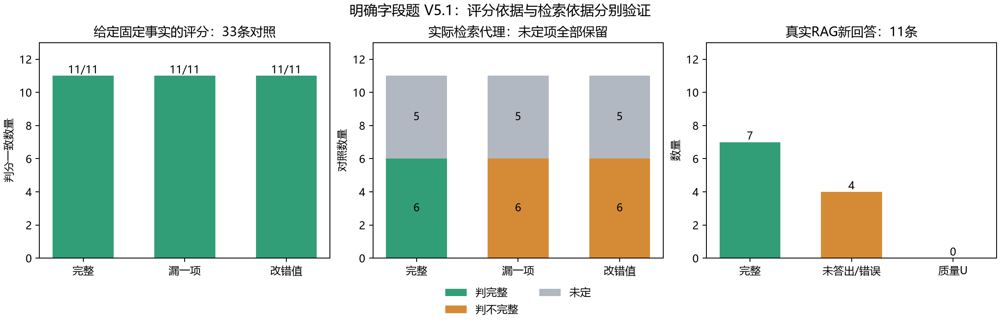

# 明确字段题 V5.1：自动评分与检索代理结果

## 本轮完成内容

从原12道已用题对应的MinerU论文片段生成12道新候选，保留全部初稿及审查。初稿曾出现题干要求四项但事实清单仅三项、题干引文不连续、集合/公式不符合单字段规则等情况。两个来源审查器没有发现全部范围缺陷，因此在任何测试答案产生之前另立V5.1范围修订协议：定位范围仅由原题干和公共字段提取，程序按最终字段标签构造完整题干，来源审查再次进行。

最终 11/12 道新题通过程序规则与两轮来源核查。1道公式题保留未通过。所有题库记录保持pending；本轮11题仅用于自动实验，正式题库准入是另一项工作。公开代理输入没有规范字段值。

先冻结源文事实、字段清单、全部33条已知控制回答和检索配置，再生成11条真实RAG回答。控制回答分别是逐项完整、删除第一项、只改错第一项的数值/名称；其标签由程序修改确定。两类评价分别进行：离线评分器获得固定源文事实；临时覆盖代理从问题检索原文并自行提取字段事实。二者不混为一个结果。

## 结果一：有固定源文事实时的评分

33条控制回答：判分一致 **33/33**，错误 0，未定 0。完整/遗漏/改错三类分别为11/11一致。预先设定的评分诊断门槛：**passed**。

这是带固定事实依据且控制答案标签已知的小样本检验，支持明确字段下的判分一致性；不表示自然语言回答、复杂同义表达、所有论文或真实故障都能可靠评价。源文事实仍经同一供应商自动双审，未充当独立人工金标准。

## 结果二：实际检索代理

|条件|样本数|确定完整|确定不完整|质量U|代理U|完整误报|不完整检出|不完整判完整|不完整未定|规则拒答|
|---|---:|---:|---:|---:|---:|---:|---:|---:|---:|---:|
|完整对照|11|11|0|0|5|0|0|0|0|0|
|遗漏对照|11|0|11|0|5|0|6|0|5|0|
|改错对照|11|0|11|0|5|0|6|0|5|0|
|真实新回答|11|7|4|0|5|0|0|0|4|1|

检索代理依据有效 6/11题。22条不完整控制回答中检出 12 条，10 条未定；U计为未检出，不能称为100%检出。11条完整对照中5条代理U，零确定误报同样不能解释为全部正常通过。

实际检索代理预设门槛：**not_passed**。

- enough_questions: True
- control_proxy_available: False
- complete_false_flags: True
- omitted_detection: False
- corrupted_detection: False
- candidate_scope_acceptance: True

## 未定项定位

|题号|原候选组|代理依据有效|主要原因|真实回答质量|真实代理状态|规则拒答|
|---|---|---:|---|---|---|---:|
|O0001|T0001|0|literal_value_or_quote_validation|2|U|0|
|O0002|T0002|1||2|complete|0|
|O0003|T0003|1||2|complete|0|
|O0004|T0004|0|retrieved_evidence_insufficient|0|U|0|
|O0005|T0005|1||2|complete|0|
|O0006|T0006|1||2|complete|0|
|O0007|T0008|0|retrieved_evidence_insufficient|0|U|1|
|O0008|T0009|1||2|complete|0|
|O0009|T0010|0|retrieved_evidence_insufficient|0|U|0|
|O0010|T0011|0|retrieved_evidence_insufficient|0|U|0|
|O0011|T0012|1||2|complete|0|

原因计数：{'literal_value_or_quote_validation': 1, 'retrieved_evidence_insufficient': 4}。4题的前3段缺少指定表格/日期资料，1题的ε-SVM模型写法与原文LaTeX表示不完全一致，逐字值验证保留U。对于后者，两轮语义核查有支持判断，问题发生在表达形式校验。

本轮11条真实RAG新回答中7条自动判完整、4条未答出指定字段，质量U为0。4条不完整回答的代理均为U，其中3条没有被当前规则识别为明确拒答。原始回答分别是逐字段‘未找到’或‘无法依据参考上下文提供所要求字段’，实际均说明材料不足；这是规则漏识别，不能当作‘模型直接作答但不拒答’的隐蔽错误证据。

新增rag_field_refusal.py作为后验开发规则，只看公开字段与回答：识别全部字段逐项未找到和明确无法提供所需字段，同时保留部分回答、一般性市场不确定性及引用尾注的排除测试。新旧相关4项测试通过；在本轮11条已有回答上，拒答由1条补至4条，恰好补上S0003、S0005、S0018。此为调试回放，原冻结指标保持原值，后续需新回答验证，不能把回放当独立性能证据。详见refusal_rule_development.csv/json。

## 下一步

先修检索：根据公开论文定位范围、表号、模型名和每个字段分别构造查询，评估是否需要召回表格所在窗口及相邻说明，减少完整文件名和题干模板对排名的影响。新的排名输入仍不包含规范字段值/答案/摘录，先做本地召回诊断，再冻结配置进行新回答对照。现有11题可用于检索开发，下一次泛化验证需另留新题或新来源。

同时处理ε等符号的来源表示映射，保留原文位置，避免把符号显示差异当成依据不存在；不得放宽数值、对象或单位相等规则。字段式拒答开发规则须在新回答中一并验证。稳定检索与代理可用性后，再验证缺证据的真实RAG故障和长序列变点信号。

## 审计与文件

相关20项测试通过；完整性审计 passed。243个唯一新API响应，492896 tokens，实际模型 {'deepseek-flash': 243}，无失败请求，评分阶段schema重试 0 次、引用重试 0 次。

原文哈希、29篇源文、检索原始位置、字段题构造、修订在答案前锁定、固定控制标签、输入白名单及从原始响应重算评分均已核对。

候选表：[finance_objective_v5_candidates_20261002.csv](E:/file/agent/python.v/project/data/annotations/finance_objective_v5_candidates_20261002.csv)；全部候选status=pending。
