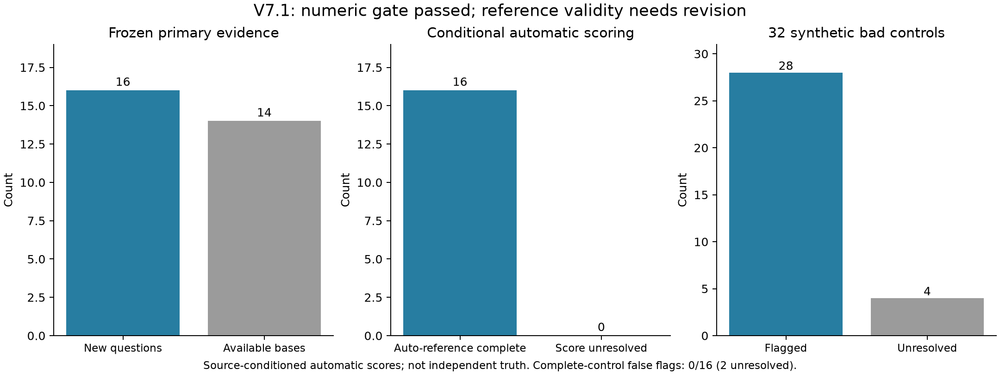

# 前瞻新题验证V7.1：有效性复查及开发修复

## 当前结论

**预设数值门槛通过，但参考答案有效性仍需修订。本轮不能宣称16题全部真实正确，也不能宣称变点检测已完成验证。**

本轮8篇论文、16道新题；新生成16条正常回答，另有48条合成对照。自动参考评分为完整16/16；遗漏/改错对照检出28/32，另有4条未定。完整对照误报0/16，其中2条代理未定，不能将未定理解为正确判定。
原始题库、标准答案、64例评分、检索配置和门槛全部保留。后续复查没有剔除题目，没有改写原成绩。

## 发现的问题

|项目|原始现象|判断与处理|
|---|---|---|
|P0001：题干/参考语义|字段要求Y_pre1等变量的“交易日后价格”，参考却填交易日数；盲提取与两轮核查均认为原文没有所问具体价格|来源表给的是预测间隔和二分类含义。先前两轮带参考的候选检查通过，显示自动评审可以共同接受错误字段关系。当前题需要修改问法并重新入选，不能靠参考去填补盲提取|
|P0002：数值与单位|原文已经检到；临时提取把数值和单位一起放入expected，现行数值校验拒绝|新的开发规则只对有逐字来源的单个数字＋已知单位拆分，保留原文位置；没有单位换算或数值改动|
|P0003：百分号表示|一个参考字段expected已含%，unit又为%；合成完整答案重复百分号|后续数值比较保留百分数的量级，构造答案只输出一次符号。不能把5%等同于无单位0.05；本轮原始对照保留|

上述问题首先属于题目/评价管线；P0001和P0002的相关原文均已检索到，不能统一归因于检索漏检。

## 离线开发回放

- 原规则核对依据有效14/16；新单位规则离线回放有效15/16。
- 新准入一致性检查在现有盲提取上通过15/16，P0001被拦下。
- 回放复用历史检索原文和模型输出，没有新增回答或评分请求。它用于验证修复方向，不构成新的前瞻验证，也不产生更新的故障检出率。
- 下一轮要在候选来源卡片上重新做不含标准答案的提取与两轮核查，然后才和拟定参考比较，全部流程先于待测回答。当前回放使用检索证据，不能冒充已执行这一步。

## 原始实验的范围

8篇论文未参与当时覆盖方法的开发/筛选，但早已存在于知识库和旧标注集；每篇2题，题目与合成对照不完全独立。当前复查后这些题和来源已成为开发资料，不能再次称为未见来源验证。
候选、提取、两轮检查和评分使用同一服务。实际返回模型为deepseek-flash，请求模型为deepseek-chat。即便多轮一致，也不是独立人工真值。来源以MinerU原始table/text块为条件，未独立逐页验证PDF。
全程272个新API响应，367777 tokens。完整性审计为passed，核查的是请求、哈希、来源位置和成绩推导；它不能证明参考答案语义正确。
来源选择、新题构造、字段检索、句子边界、数值单位与准入检查的关联测试通过30项；其中新增修复测试17项。两幅结果图已检查布局与数字。
测试回答生成前还纠正过一次来源卡片：旧准备把chart重建当作table，4道候选受影响。旧记录完整保留且未生成待测回答；新准备只选择原始table/text块并拒绝明确近似值。

## 后续顺序

1. 将新增的盲提取准入、一致性拒绝、严格单位拆分和百分号构造规则冻结到下一轮。P0001重新构造明确询问预测间隔的新候选，当前题保留在问题清单。
2. 从未用于这些实验的原始table/text片段生成新题；先去重并记录全部候选/未定，再做来源盲提取、两轮检查和参考一致性核验。当前8篇已成为开发来源，若仍从现有38篇语料出题，应明确报告“新题、已有来源”；未见论文的结论需要另增论文。
3. 预先冻结题库、方法、评价门槛和全部案例，再生成新的正常回答与单字段合成对照。通过有效性检查后，建立真实正常/证据故障配对；评分依据来自正常证据，干预仅作用于生成输入。
4. 真实故障确实产生质量下降后再进入长序列变点实验，按论文/题目分组报告，并与简单拒答/滑窗基线比较。

上述工作可以继续自动进行，无需新增人工复核；结论应始终写作来源条件下的自动评价。当前不修改正式RAG运行路径，也未提交或推送GitHub。

## 文件

[原始数值报告](rag_prospective_v7_1_primary_report_20261002.md)；[完整性审计](experiments/prospective_exact_source_v7_1_20261002/integrity_audit.json)；[有效性汇总](experiments/prospective_exact_source_v7_1_20261002/validity_review/validity_summary.json)。

下图展示原始冻结成绩。中间的完整数以自动参考为条件，不能解读为独立确认的正确率。

