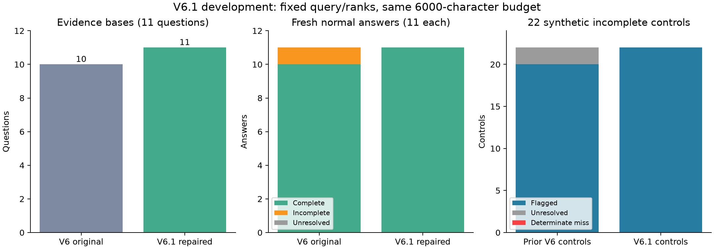

# 句子边界修复V6.1：开发回归验证

## 结论

固定同一批11题，检索核对依据有效数 10→11；新生成完整回答 10→11；逐题改善 1，退化 0，质量未定配对 0。
针对上一轮年份截断题O0011，新回答质量 1→2，代理 U→complete；预先锁定的修复成功门槛：**passed**。
22条合成遗漏/改错对照检出 22，确定漏检 0，未定 0；完整对照误报 0/11。原自动评分门槛 **passed**。

## 具体改动

保留V6选定的3个段落、来源、排名和重排分数，仅在原文内修复段尾边界；每段最多2000字符，每题合计不超过6000字符。
段尾在句中时，向后最多寻找256字符，补齐至句末/表格行末。在长度不足时，只从开头裁掉到一个完整边界；保护原窗口内完整包含的表格。数字小数点不当句号，成对数学分隔符内的换行不当边界。
无法在预算内安全补齐则保留原窗口，并明确记录未解决。选择和边界修复均不接收规范字段值、规范摘录、答案或质量标签。
33段的边界状态：{"repaired": 31, "unchanged_already_complete": 1, "unresolved_no_tail_boundary": 1}。未解决段尾的存在不直接等同于回答缺失，仍由语义核查判断。

## 设计与冻结

- 沿用已见11题及原参考字段。两种配置均重新生成11条正常回答，另有33条合成完整/遗漏/改错对照。
- 检索结果、全部核对依据、55案例及修复成功门槛在本轮新回答前冻结。
- 问题和来源范围、模型请求别名、生成温度/长度、评分提示词、符号映射及拒答规则沿用V6。
- 两种配置的排名固定，本轮只比较预算内的边界修复；每题都保留，不依据回答重新选配置。

## 全部结果

|条件|N|完整|不完整|质量U|代理U|坏回答检出|坏回答U|确定漏检|完整误报|
|---|---:|---:|---:|---:|---:|---:|---:|---:|---:|
|controls|33|11|22|0|0|22|0|0|0|
|control_complete|11|11|0|0|0|0|0|0|0|
|control_omitted|11|0|11|0|0|11|0|0|0|
|control_corrupted|11|0|11|0|0|11|0|0|0|
|live_baseline|11|10|1|0|1|0|1|0|0|
|live_enhanced|11|11|0|0|0|0|0|0|0|

## 逐题新回答配对

|题号|V6质量|V6.1质量|V6代理|V6.1代理|
|---|---:|---:|---|---|
|O0001|2|2|complete|complete|
|O0002|2|2|complete|complete|
|O0003|2|2|complete|complete|
|O0004|2|2|complete|complete|
|O0005|2|2|complete|complete|
|O0006|2|2|complete|complete|
|O0007|2|2|complete|complete|
|O0008|2|2|complete|complete|
|O0009|2|2|complete|complete|
|O0010|2|2|complete|complete|
|O0011|1|2|U|complete|

## 解释边界及下一步

这是针对已发现退化的开发回归验证，11题和论文都已见过。自动参考和两轮评分仍使用同一供应商，不能作为独立人工真值。
合成遗漏/改错只检查答案评分能力，本轮新生成均为正常回答；尚未证明真实证据故障或长序列变点的检出效果。
接下来冻结当前配置到来源或题目留出的验证集；通过后再做真实证据干预配对，并比较变点检测与简单阈值等基线。
审计 passed；6项新边界测试通过。新增API响应 207，tokens 279265，实际返回模型 {'deepseek-flash': 207}，结束原因 {'stop': 22}。

